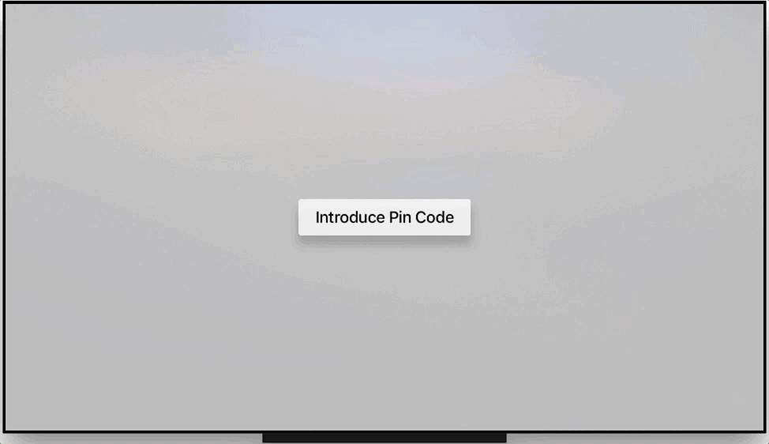

# TvOSPinKeyboard

PIN keyboard for tvOS



## Description

TvOSPinKeyboard is a view controller that allows easily asking for PIN codes in tvOS.

## Requirements

- tvOS 9.0+
- Xcode 8.2

## Installation

### Cocoapods

To integrate TvOSPinKeyboard into your Xcode project using CocoaPods, specify it in your `Podfile`:

```ruby
source 'https://github.com/CocoaPods/Specs.git'
platform :tvos, '9.0'
use_frameworks!

target '<Your Target Name>' do
    pod 'TvOSPinKeyboard', :git => 'https://github.com/zattoo/TvOSPinKeyboard.git'
end
```

## Usage

All you need is to create an instance of TvOSPinViewController and to present it on the screen. Pin code will be sent back through TvOSPinKeyboardDelegate


```swift

import UIKit
import TvOSPinKeyboard

class ViewController: UIViewController, TvOSPinKeyboardViewDelegate {

    @IBOutlet private weak var pinLabel: UILabel!

    @IBAction func pinButtonWasPressed(_ sender: Any) {
        let pinKeyboard = TvOSPinKeyboardViewController(withTitle: "Introduce your PIN", message: "A pin code is required")
        pinKeyboard.delegate = self

        present(pinKeyboard, animated: true, completion: nil)
    }

    // MARK: - TvOSPinKeyboardViewDelegate

    func pinKeyboardDidEndEditing(pinCode: String) {
        pinLabel.text = "Your Pin Code is: " + pinCode
    }
}
```

## Customization

Apart from the title, subtitle, TvOSPinKeyboard offers a wide level of customization

Customizable properties:

- backgroundView
- titleFont
- titleColor
- subtitleFont
- subtitleColor
- pinFont
- pinColor
- pinBackgroundColor
- numpadButtons
- numpadFont
- deleteButtonTitle
- deleteButtonFont
- buttonsNormalTitleColor
- buttonsFocusedTitleColor
- buttonsFocusedBackgroundColor
- buttonsFocusedBackgroundEndColor
- buttonsNormalBackgroundColor
- buttonsNormalBackgroundEndColor

